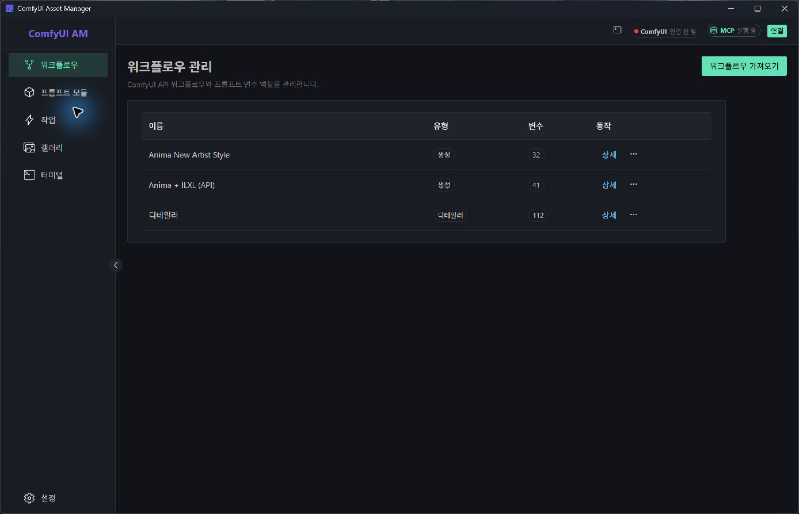
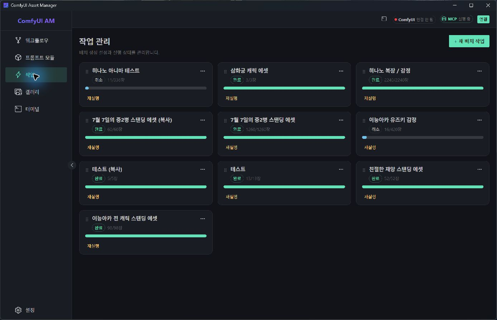
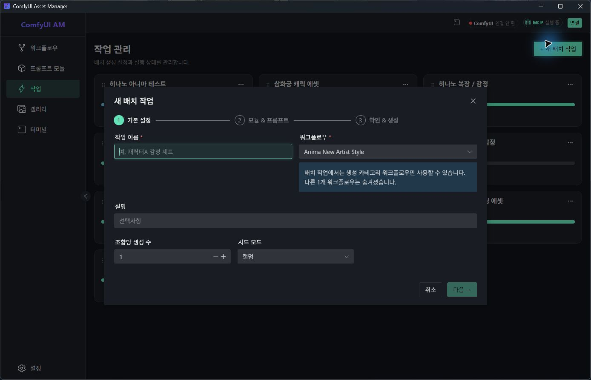
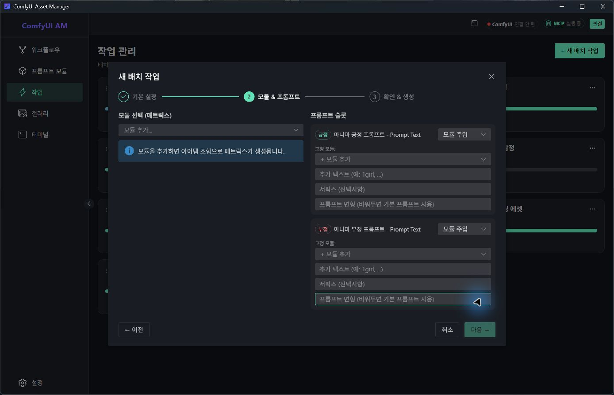
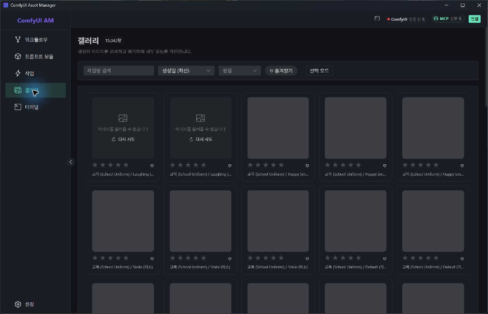
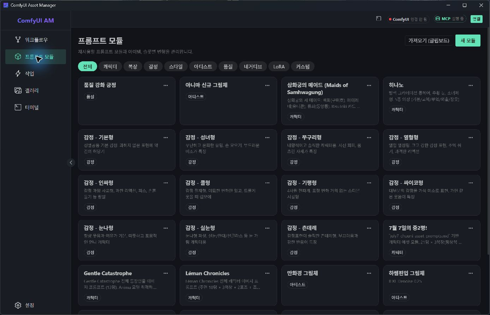
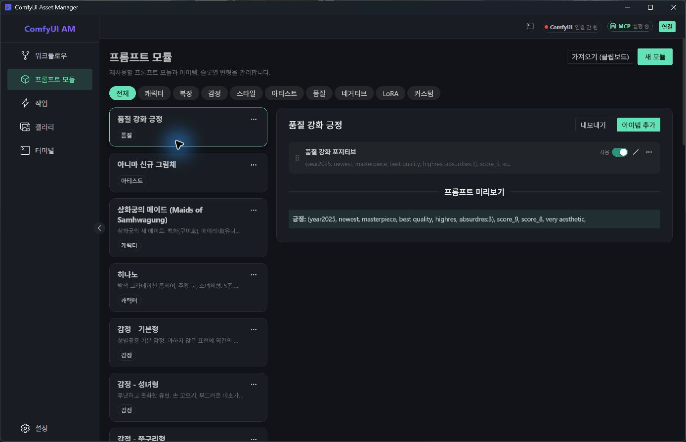

# ComfyUI Asset Manager UI/UX 재검토

> 2026-08-12 리디자인 전 화면을 검토한 역사적 기록이에요. 아래의 “현재”, 코드 줄번호, 결함과 권장안은 당시 상태를 뜻하며 현행 제품의 결함 목록이나 구현 지시가 아니에요. 이후 구현 기록은 [프로덕션 리디자인 회고](../production-redesign-progress.md), 시각 검증 기록은 [디자인 QA](../../design-qa.md)에 있어요. 현재 상태는 다시 확인해야 해요.

검토일: 2026-08-12

## 결론

현재 제품은 “리소스 관리 앱”처럼 구성되어 있지만 실제 사용 중심은 “생성 조립 → 대량 실행 → 결과 선별”입니다. 전면 리디자인은 이전 시안 1의 생성 집중 구조와 시안 3의 프로덕션 모니터 구조를 결합하는 편이 가장 적합합니다. 시안 2의 자유 캔버스 방식은 실제 데이터가 텍스트 중심이고 모듈·아이템 수가 많아질수록 탐색 비용이 커지므로 주 구조로 권하지 않습니다.

권장 화면 기준은 1440×1024보다 실제 앱 창에 가까운 1366×768 또는 1440×900입니다.

## 감사 범위와 사용자 목표

- 범위: 전역 탐색, 워크플로 목록, 작업 목록, 새 배치 작업 1·2단계, 모듈 목록·상세, 갤러리
- 목표: 저장된 워크플로와 프롬프트 모듈을 빠르게 조합하고, 대량 실행 상태를 판단하며, 생성 결과를 선별하는 것
- 접근성 목표: 키보드로 주요 흐름을 완료할 수 있고, 상태·선택·실패가 색이나 작은 보조문구에만 의존하지 않는 것

## 화면별 평가

### 1. 워크플로 목록 — 보통

- 표 구조는 항목 비교에 적합하고, 가져오기 행동도 분명합니다.
- 그러나 앱 시작점이 워크플로 관리로 고정되어 있어 반복 사용자에게 가장 중요한 생성·실행 흐름까지 한 단계 더 필요합니다.
- 워크플로는 자주 수정하는 작업보다 생성에 투입되는 자원에 가깝습니다. 새 구조에서는 `라이브러리` 아래로 이동시키고 시작 화면은 `프로덕션` 또는 `새 생성`이어야 합니다.

### 2. 작업 목록 — 개선 필요

- 실제 데이터에서는 완료·취소 작업이 빠르게 누적됩니다.
- 동일 크기 카드와 동일한 진행 막대가 모든 작업에 반복되어, 실행 중인 작업과 오래된 완료 작업의 중요도 차이가 거의 보이지 않습니다.
- 검색, 상태 필터, 정렬, 실행 시각, 워크플로 구분이 없어 이력이 많아질수록 찾기 어렵습니다.
- 권장 구조는 `실행 중 1개 확장 + 대기 큐 행 목록 + 최근 완료 테이블`입니다. 카드 그리드는 제거하는 편이 낫습니다.

### 3. 새 배치 기본 설정 — 보통

- 3단계 진행 표시와 필수값, 사용할 수 없는 워크플로 안내는 명확합니다.
- 900px 모달 안에서 전체 생성 설정을 끝내는 구조라 정보가 늘어날수록 스크롤과 맥락 전환이 커집니다.
- 작업 이름보다 `무엇을 몇 장 만들 것인가`가 먼저 보여야 합니다. 워크플로 선택 후 예상 출력과 최근 사용 구성을 즉시 보여주는 편이 좋습니다.

### 4. 모듈·프롬프트 조합 — 위험

- 이 화면이 실제 제품의 핵심이지만, 빈 좌측 패널과 입력이 많은 우측 패널이 같은 비중을 차지합니다.
- 모듈 선택, 아이템 선택, 슬롯 주입, 접두 모듈, 추가 텍스트, 서픽스, 변형이 한 단계 안에 동시에 노출됩니다.
- 무엇이 최종 프롬프트에 들어가고 조합 수가 어떻게 바뀌는지 즉시 확인할 수 없습니다.
- 모달 대신 전체 화면 `생성 스튜디오`가 필요합니다: 왼쪽 검색 가능한 모듈 라이브러리, 중앙 조합 레시피, 오른쪽 항상 보이는 최종 프롬프트·출력 수·검증 요약 구조가 적합합니다.

### 5. 갤러리 — 현재 검증 차단

- 15,042개 자산이 있는 실제 상태에서 썸네일이 로딩 실패 또는 스켈레톤으로 남아 선별 흐름을 완전히 검증할 수 없었습니다.
- 현재 필터는 파일명, 정렬, 평점, 즐겨찾기뿐입니다. 대량 자산에서는 작업, 워크플로, 캐릭터, 의상, 감정, 생성일 범위 필터가 더 중요합니다.
- 카드마다 별점과 즐겨찾기를 항상 배치하면 이미지 면적이 줄어듭니다. `접촉 인화지형 그리드 + 선택 시 우측 인스펙터 + 키보드 평가`가 적합합니다.
- 개별 카드마다 재시도시키기보다, 경로 또는 프로토콜 문제를 상단에서 한 번 설명하고 전체 재시도·진단 행동을 제공해야 합니다.

### 6. 모듈 라이브러리 — 개선 필요

- 유형 필터는 이해하기 쉽지만 검색이 없고, 작은 카드가 동일한 비중으로 반복됩니다.
- 긴 이름과 설명이 잘려 실제 선택 근거가 약해집니다. 아이템 수, 최근 사용, 연결된 슬롯 같은 실용 메타데이터도 없습니다.
- 유형 필터는 유지하되 검색·정렬·즐겨찾기·최근 사용을 추가하고, 기본 표현은 밀도 높은 목록이 적합합니다.

### 7. 모듈 상세 — 양호

- 목록을 좁은 왼쪽 열로 바꾸고 상세를 오른쪽에 유지하는 구조는 현재 앱에서 가장 좋은 패턴입니다.
- 이 패턴을 워크플로, 작업, 갤러리에도 일관되게 확장할 가치가 있습니다.
- 다만 프롬프트 미리보기는 긴 텍스트를 읽고 비교하기에 너무 낮고, 편집·사용 여부·추가 행동의 우선순위가 약합니다.

## 코드에서 확인된 구조적 원인

- 루트가 워크플로로 리디렉션됩니다: `src/renderer/src/router/index.ts:14`.
- 작업은 검색·필터 없는 자동 채움 카드 그리드입니다: `src/renderer/src/views/JobsView.vue:185`, `src/renderer/src/views/JobsView.vue:226`.
- 작업 카드가 이름·상태·진행률·재실행만 반복합니다: `src/renderer/src/components/jobs/JobCard.vue:58`.
- 생성 흐름 전체가 고정 폭 900px 모달 안에 들어갑니다: `src/renderer/src/components/jobs/BatchWizard.vue:319`.
- 핵심 조합 화면은 두 열에 다수의 인라인 컨트롤을 동시에 노출합니다: `src/renderer/src/components/jobs/WizardStepModules.vue:67`.
- 모듈 목록은 유형 필터만 있고 검색이 없습니다: `src/renderer/src/views/ModuleView.vue:74`, `src/renderer/src/components/modules/ModuleTypeFilter.vue:10`.
- 갤러리 필터는 파일명·정렬·평점·즐겨찾기에 한정됩니다: `src/renderer/src/components/gallery/GalleryFilterBar.vue:31`.
- 갤러리는 고정 5열 카드 그리드이고, 별점·즐겨찾기가 모든 카드에 상시 노출됩니다: `src/renderer/src/views/GalleryView.vue:324`, `src/renderer/src/components/gallery/GalleryImageCard.vue:23`.

## 접근성 위험

- 모듈 카드는 클릭 가능한 `NCard`라 접근성 트리에서 버튼이 아닌 그룹으로 노출됩니다. 키보드 진입과 포커스 표시를 별도로 검증해야 합니다.
- 작업 재정렬 손잡이는 텍스트 기호 `⠿`, 모듈 제거는 `✕`, 즐겨찾기는 `♥/♡`에 의존합니다. 명확한 접근 가능한 이름과 아이콘 버튼이 필요합니다.
- 11px 보조문구와 0.5~0.7 불투명도가 광범위하게 사용되어 작은 창과 저대비 환경에서 읽기 어렵습니다.
- 상태가 민트·파랑·노랑과 작은 태그에 많이 의존합니다. 텍스트 상태, 아이콘, 위치를 함께 사용해야 합니다.
- 스크린샷과 Windows 접근성 트리로 구조는 확인했지만, 전체 키보드 순서, 스크린리더 낭독, 실제 색 대비 수치는 별도 테스트가 필요합니다.

## 당시 권장했던 리디자인 방향

1. **프로덕션을 기본 화면으로**: 활성 실행, 대기 큐, 최근 결과, `새 생성`을 한 화면에 배치합니다.
2. **생성 스튜디오를 전체 화면으로**: 모듈 선택과 슬롯 매핑을 시각적 캔버스가 아닌 검색 가능한 레시피 빌더로 만듭니다.
3. **워크플로와 모듈을 라이브러리로 통합**: 상위 내비게이션을 `프로덕션 / 생성 / 라이브러리 / 결과`로 줄이고 터미널·설정은 도구 영역으로 이동합니다.
4. **작업 카드를 큐와 테이블로 교체**: 실행 중인 한 작업만 확장하고 나머지는 비교 가능한 행으로 표시합니다.
5. **갤러리를 선별 도구로 전환**: 작업 기반 필터, 우측 인스펙터, 키보드 평가, 비교 선택을 중심으로 구성합니다.
6. **시각 체계 정리**: 민트는 주요 행동과 현재 선택에만 사용하고, 완료 상태는 중립화합니다. 본문 14px 이상, 보조문구 12px 이상과 명시적 포커스 링을 기준으로 삼습니다.

## 근거 한계

- ComfyUI는 연결되지 않은 상태였고 실행·취소·삭제는 수행하지 않았습니다.
- 갤러리 썸네일 로딩 실패로 상세 이미지 선별 흐름은 검증하지 못했습니다.
- 라이트 테마, 작은 창 리플로, 긴 한국어·영어 혼합 문자열은 별도 캡처하지 않았습니다.
